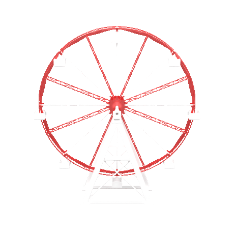
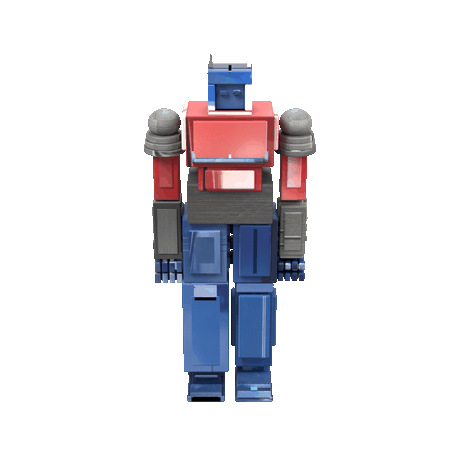
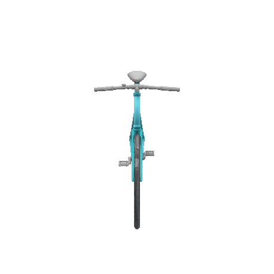
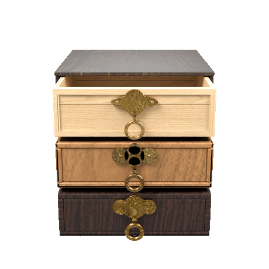
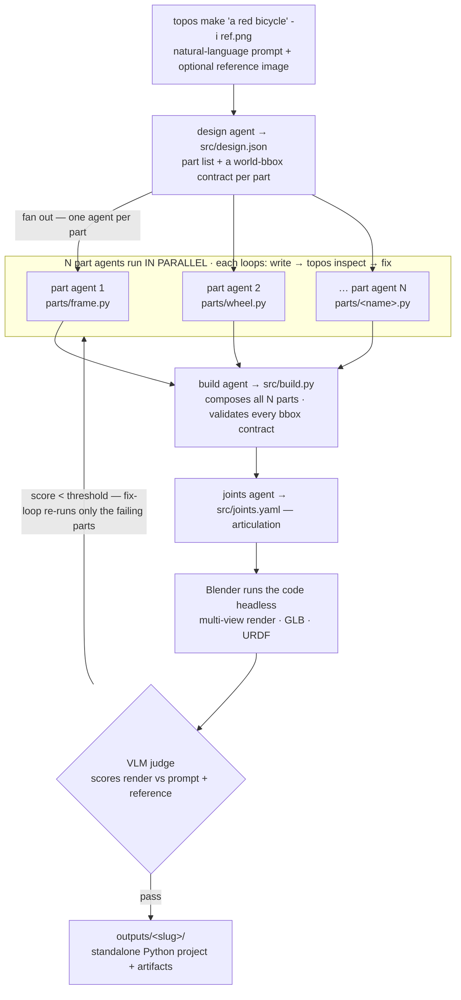

<p align="center">
  
</p>

<h3 align="center">Towards Agentic 3D Procedural Generation Without Human Feedback</h3>

<table align="center"><tr>
<td></td>
<td></td>
<td></td>
<td></td>
</tr></table>

<p align="center"><sub>Each built procedurally from a text prompt (+ optional reference image). The geometry IS Python you can read, edit, and re-run.</sub></p>

<p align="center">
  A harness where a team of <b>coding agents</b> collaborate to write a <b>standalone, multi-file Python
  project</b> that Blender runs to build a 3D object from scratch — geometry, articulation, and
  <b>prompt-conditioned textures</b> — scored and repaired by a vision-model judge in a closed loop,
  no human in the loop. The deliverable is runnable code, not a mesh blob: no mesh-prior models, no
  diffusion, no asset libraries — every object is constructed one <code>bpy</code> call at a time.
</p>

> [!NOTE]
> **OpenTopos is a work-in-progress research preview.** It's under active development — expect rough edges, sharp changes, and geometry that doesn't always land. Found a bug or have an idea? Please [open an issue](https://github.com/gaoypeng/opentopos/issues) — feedback is very welcome.

---

## What it actually does

You give it a prompt. A team of coding agents (Claude / Gemini / Codex CLI) write a small Python project into `outputs/<slug>/src/` — a `design.json` part list, one `build_<part>()` file per part, a `build.py` that assembles them, and a `joints.yaml` for articulation. Blender runs that code **headless** to produce renders + a GLB + a URDF. A vision model judges the multi-view render; if it's below threshold a fix-loop edits the code and re-runs.

The point: **the code is the truth.** The mesh/GLB/URDF under `artifacts/` are derivative — delete them and re-run the Python to get them back. The output runs in any Blender without this framework.

```bash
topos make "a turquoise hybrid bicycle with flat handlebars" -i bicycle.webp
# → outputs/turquoise_hybrid_bicycle/  (src/ Python project + artifacts/ renders+GLB+URDF)
```

## How it works

Coding agents write *into a real codebase*; Blender runs that codebase. Each part agent can `topos inspect` its own geometry mid-task — build it headless, measure the bounding box, render a preview, and fix the code before handing in (instead of coding blind).



> Independent parts are written **concurrently** — N part agents, N stateless Blender subprocesses, no shared state. The bbox contract in `design.json` is what keeps them aligned without talking to each other; the build agent validates each part's world bbox against it (5 mm tolerance).

## What you get on disk

```
outputs/<slug>/
├── src/                    # the deliverable — runs in any Blender, zero framework deps
│   ├── design.json         #   part list + per-part world-bbox contract (5mm tolerance)
│   ├── parts/<name>.py     #   one build_<name>() per part — pure geometry
│   ├── build.py            #   composes all parts into the assembled scene
│   └── joints.yaml         #   articulation (URDF joint tree)
├── artifacts/              # derivative — freely deletable, regenerated from src/
│   ├── object_render/      #   8-view EEVEE renders
│   ├── object.glb          #   whole-scene GLB (trimesh/Three.js loadable)
│   └── object.urdf         #   valid URDF (urdfpy/RViz/Webots loadable)
├── trajectories/           # full per-task transcript + cost + judge score
└── run_report.json         # scores, cost, token + time breakdown
```

A static/rigid object is just an articulated one whose joints are all `fixed` — same pipeline either way.

## Install

```bash
git clone https://github.com/gaoypeng/opentopos && cd opentopos
pip install -e .                      # installs the `topos` CLI

# Blender (5.0+). Either a system Blender on PATH, OR vendor one under the repo
# so the checkout pins its own version (vendor/ is gitignored, ~300MB):
mkdir -p vendor && cd vendor
curl -LO https://download.blender.org/release/Blender5.0/blender-5.0.0-linux-x64.tar.xz
tar xf blender-5.0.0-linux-x64.tar.xz && mv blender-5.0.0-linux-x64 blender && cd ..

# A coding-agent CLI. Claude is the default backend:
#   install the `claude` CLI (https://claude.com/claude-code) and log in.
#   Gemini and Codex CLI backends are also wired up.

# Optional: a Gemini API key for image-conditioned textures (Nano Banana).
topos config set image_gen.gemini.api_key <key>   # https://aistudio.google.com/app/apikey

topos doctor                          # verifies python / agent CLI / Blender / config
```

`topos doctor` auto-detects Blender (vendored `./vendor/blender/` wins over a system one). `blender.binary` accepts an absolute path or a project-relative `./vendor/blender/blender`.

## Usage

```bash
# THE entry point: prompt (+ optional reference images) → workspace → auto-run
topos make "a 6-drawer steel tool cabinet"
topos make "Optimus Prime, standing" -i optimus.png --slug optimus

# Re-run an existing workspace's plan (e.g. after editing src/ by hand)
topos run optimus

# Pick the coding-agent backend for a new workspace:
topos make "a 6-drawer steel tool cabinet" --backend gemini

# Or set the default once, then plain `topos make ...` will use it:
topos config set backends.default gemini

# Inspect a build's geometry yourself (or what the part agents call mid-task):
topos inspect optimus                 # whole assembly: per-part bbox, overlaps, contract
topos inspect optimus --part Head     # one part in isolation + a preview PNG

# Cost / token / time breakdown of the last run
topos cost optimus --by-model

# List + install the agent skill bundles
topos skill list
```

### Choosing a backend

| backend | model | notes |
|---|---|---|
| `claude` (default) | Opus / Sonnet via the `claude` CLI | strongest geometry; subscription or API key |
| `gemini` | `gemini-3.x-flash` via the `gemini` CLI | fast + cheap; great on regular structures |
| `codex` | via the `codex` CLI | OpenAI models |

The whole pipeline (coding agents, the VLM judge, the texture image-gen) is swappable per backend.

## The inspect loop — agents see their own geometry

The recurring failure mode of "LLM writes bpy code blind" is wrong proportions, stub limbs, and parts that float or interpenetrate — none of which the model notices until the final render. `topos inspect` closes that loop **inside the agent's turn**: it builds the geometry headless, measures every part's world bounding box, flags overlaps / floating / degenerate parts / contract drift, and renders a preview the agent can look at. Part and build agents are taught (via the `topos_geometry_inspect` skill) to write → inspect → fix → re-inspect before handing in.

It is OpenTopos-native and stateless — same idea as a live Blender-MCP session, but the artifact stays reproducible code, and N parts inspect in parallel.

## Architecture

```
L7 CLI            topos make · run · inspect · doctor · config · cost · skill
L6 Domain         rigid / articulated  (plan.json template + rubric + examples)
L5 Orchestrator   DAG runner (agent / tool / subgraph tasks), fix-loop, runtime fan-out
L4 Critic         VLM judge; rubric YAML decoupled from code
L3 Knowledge      agent skill bundles (topos/skills/) · local Blender API index (bpy_docs)
L2 Tools          @tool capabilities: render · export_glb · export_urdf · judge · inspect ...
L1 Agent backends ClaudeCLI (default) · GeminiCLI · CodexCLI
L0 Substrate      Workspace · stateless Blender runtime · config (defaults < user < repo < env)
```

Design rationale lives in [`docs/decisions/`](docs/decisions) (ADRs): code-as-truth, stateless-Blender, the design.json bbox-contract, three-layer prompts. Deeper reference: [`docs/architecture.md`](docs/architecture.md), [`docs/extending.md`](docs/extending.md), [`docs/config.md`](docs/config.md).

## Status

Articulated objects work end-to-end (design → parts → build → joints → render/GLB/URDF → judge → fix-loop). The output is multi-file Python with bbox-contract validation; per-part + whole-scene GLB and a valid URDF, all parseable by trimesh / urdfpy / Blender. Procedural geometry currently caps at clean blocky forms — dense mechanical detail is the active frontier.

```bash
pytest -m 'not integration'           # fast unit suite (no Blender / no LLM)
```
