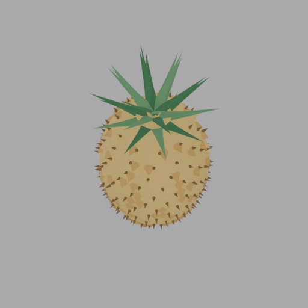

# Generated Pineapple

Standalone generated Blender case for a stylized pineapple. The object is
built procedurally from `src/build.py`: an oval pineapple body, raised diamond
skin scales, small thorn tips, and layered crown leaves.



## Regenerate

From the repository root:

```bash
blender --background --python examples/generated_pineapple/src/build.py
```

To render/export with the Topos tool wrappers, copy or run this case inside a
Topos workspace and point the wrappers at `src/build.py`.

The GLB is intentionally not committed because mesh exports are derivative
artifacts; the source code is the case.
